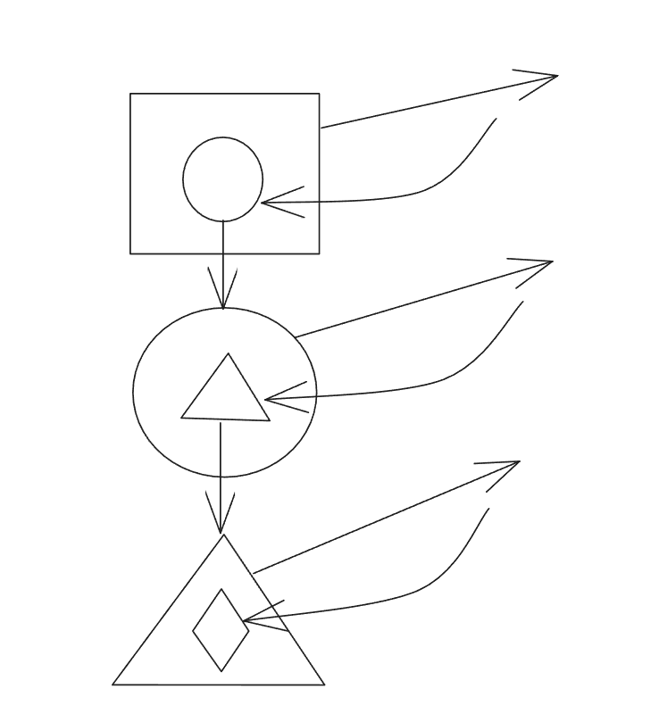
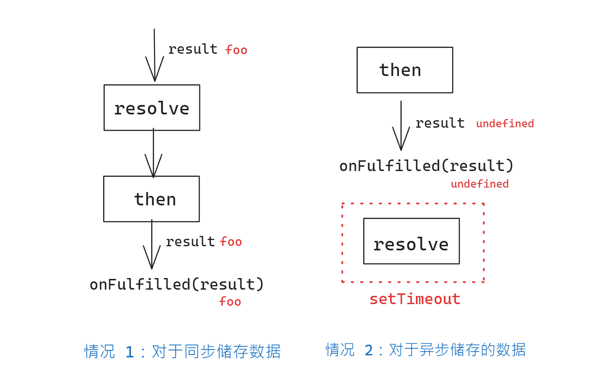

# Nodejs 学习笔记

> 名称：Node.js 完全指南（李立超）
>
> 地址：https://www.bilibili.com/video/BV1qN4y1A7jM/?vd_source=bc02b194f06ee6c081a8d33ad7b3824d
>
> 简介：讲师-李立超（超哥）
>
> 信息：全 34 集:24 时 53 分 44 秒 （二倍速：12 时 26 分 52 秒）
>
> 源码：链接：https://pan.baidu.com/s/1jE10ooFCzpV6ddSqHyYJow?pwd=9658
> 提取码：9658
>
> 学习目标：争取 1~2 周内搞定，提升效率，2023/5/20 ~
>
> 李立超博客（nodejs 配套笔记）：https://www.lilichao.com/index.php/2022/10/08/node-js%e7%ae%80%e4%bb%8b%e5%ae%89%e8%a3%85/

## Nodejs 简介和安装

**1，简介**

`Node,js`是一个构建在 V8 引擎之上的`JavaScript`运行环境。它使得 JS 可以运行在**刘览器以外**的
地方。相对于大部分的服务端语言来说，`Node,js`有很大的不同，它采用了**单线程**，且通过**异步**
的方式来**处理并发**的问题。

**2， 安装**

Step1：访问 [官网](https://nodejs.org/en) 下载 LTS 版本（18.16.0 LTS）

Step2：下载后本地 [安装](https://www.geeksforgeeks.org/installation-of-node-js-on-windows/)

Step3：测试安装是否成功，打开命令行，输入`node -v`，若输出版本信息`V.18.16.0`，则表示安装成功

**3，使用安装工具 nvm**

nvm 是 Node Version Manager 的简称，即为 node 版本管理工具。**建议使用 nvm 安装 nodejs**

Step1：进入 GitHub [release](https://github.com/coreybutler/nvm-windows/releases) 下载最新版本 [nvm-setup.exe](https://github.com/coreybutler/nvm-windows/releases/download/1.1.11/nvm-setup.exe)

Step2：下载后安装

nvm 常用命令

```bash
# 显示 已经安装的 node
nvm list
# -----------------安装-----------------
# 安装 指定版本的 node
nvm install <版本>
# 默认安装最新版
nvm install lastest
# 安装 lts (long time support)版本
nvm install lts

# 配置 nvm 镜像服务器 (以下是 阿里云 镜像地址)
nvm node_mirror https://npmmirror.com/mirrors/node/

# 指定 node 版本
nvm use <版本>
```

**4，使用 node**

方式 1：打开命令行，输入 `node`进入**交互式**命令行，此时的环境和使用浏览器打开**开发者模式**中的 console 一样，可输入 js 代码运行。

方式 2：创建`demo.js`文件，编写 js 代码，在此文件所在目录打开命令行，输入 `node ./demo.js` 即可执行 node。

方式 3：在 VScode 中使用命令行（bash）执行代码。

方式 4：在 VScode 中的 打开的`demo.js`文件中按 `F5`会弹出选项，选择 `node`执行代码。

**5，nodejs 和 javascript 的区别**

- `ECMAScript`：nodejs 和 javascript 都具有
- `DOM，BOM`：仅浏览器环境具有，js 有，而 nodejs 不具有

---

## 同步和异步

**1，进程和线程**

- 进程：程序的运行环境（理解为工厂的仓库）
- 线程：是实际运行程序的”东西“（理解为工人）

**2，同步和异步**

同步

- 同步代码会出现 **堵塞** 现象（自上而下，先后执行），会影响 **整体程序** 的执行
- 解决同步问题：其他语言（java，python）采取**多线程**解决 ； nodejs 是**单线程**，使用 **异步**方式 解决

异步

- 某段代码不会影响其他代码的执行
- **异步的问题**：异步代码无法使用 `return`设置返回值。因为 `return`是立即返回，但是异步带啊吗不需要立即返回。
- **特点**：（1）不会发生阻塞其他的代码的现象 ； （2）需要使用**回调函数**返回值
- 基于回调的异步实现（回调地狱） ：（1）代码可读性差 ； （2）可调试性差
- 解决回调地狱：思路——需要代替回调地狱返回值，引出` promise`

```javascript
// 下面三行代码是 同步执行，依次一行一行执行
console.log("111");
console.log("222");
console.log("333");
// 下面的代码，sum函数调用会影响下一行语句的执行
function sum(a, b, callback) {
	const begin = Date.now();
	setTimeout(() => {
		callback(a + b);
	}, 4000);
}
console.log("1111111");
// 使用回调函数
// 理解回调函数的作用：暂时储存某个封装的指令，等待合适时机执行
const result = sum(123, 456, (result) => {
	sum(result, 777, (result) => {
		sum(result, 888, (result) => {
			sum(result, 999, (result) => {
				sum(result, 000, (result) => {
					console.log(result);
				});
			});
		});
	});
});
console.log("2222222");
```

回调地狱的结构图：



---

## promise

- Promise 可以帮助我们解决异步中的回调函数的问题

- Promise 就是一个用来**存储数据的容器**，它拥有着一套特殊的存取数据的方式，这个方式使得它里边可以**存储异步调用的结果**

失败时的两种处理方式

- 通过 reject('data')
- 通过抛出 Error

1，通过 reject('data')

```javascript
const promise = new Promise((resolve, reject) => {
    setTimeout(() => {
        // 通过 函数形式 xxx('数据') 的好处可以添加异步调用的数据
        // resolve('成功了耶！');
        reject('哎！，失败了');
    }, 2000);
}
promise.then(
    // 对应 resolve()的结果 : 成功时执行
    (result) => { console.log("读取到了 promise 中的数据：", result); },
    // 对应 reject()的结果  : 失败时执行
    (result) => { console.log("读取到了 promise 中的数据：", result); }
)
```

输出：

```bash
读取到了 promise 中的数据：哎！，失败了
```

2，通过抛出 Error

```javascript
const promise = new Promise((resolve, reject) => {
	/*setTimeout(() => {
        // 通过 函数形式 xxx('数据') 的好处可以添加异步调用的数据
        // resolve('成功了耶！');
        // reject('哎！，失败了');
    }, 2000);*/
	throw new Error("失败了");
});
promise.then(
	// 对应 resolve()的结果 : 成功时执行
	(result) => {
		console.log("读取到了 promise 中的数据：", result);
	},
	// 对应 reject()的结果  : 失败时执行
	(result) => {
		console.log("读取到了 promise 中的数据：", result);
	}
);
```

输出：

```bash
读取到了 promise 中的数据： Error: 失败了
```

可以看到不同方式处理错误，输出结果有所不同。

---

```javascript
// ----------------- 1.创建 promise-----------------
// 格式：new Promise( function )
// resolve, reject 也是函数
const promise = new Promise((resolve, reject) => {
	// -----------------2.将数据存到 resolve中-----------------
	/* 
    关于 resolve 和 reject 使用
        - resolve ： 执行 正常 时储存数据
        - reject  ： 执行 异常 时储存数据
    */
	setTimeout(() => {
		// 通过 函数形式 xxx('数据') 的好处可以添加异步调用的数据
		// resolve('成功了耶！');
		// reject('哎！，失败了');
	}, 2000);
});
// -----------------3.从 promise 中读取数据：通过 then()-----------------
// then的格式：promise.then( fun1,fun2 )
promise.then(
	//fun1 对应 resolve()的结果 : 成功时执行
	(result) => {
		console.log("读取到了 promise 中的数据：", result);
	},
	//fun2 对应 reject()的结果  : 失败时执行
	(result) => {
		console.log("读取到了 promise 中的数据：", result);
	}
);

/*
promise 中维护了两个隐藏属性：
    - PromiseResult：用于储存数据
    - PromiseState：记录   Promise 状态（三种）
        - pending：进行中
        - fulfilled：完成：通过 resolve 储存数据时
        - rejected：拒绝/出错了：通过 reject 储存数据时
------------
1. 当 Promise 创建， PromiseState初始值为 pending
    - 当 储存数据通过 resolve, PromiseState 修改为 fulfilled, PromiseResult 变为 储存的数据
    - 当 储存数据通过 reject, PromiseState 修改为 rejected, PromiseResult 变为 储存的数据 或 异常对象
	
	
2. 当我们通过 then 读取数据时，相当于为 Promise 设置了回调函数，
    - 如果 PromiseState 变为fulfilled,则调用 then 的第一个回调函数来返回数据
    - 如果 PromiseState 变为rejected,则调用 then 的第二个回调函数来返回数据
*/
const promise2 = new Promise((resolve, reject) => {
	setTimeout(() => {
		resolve("成功了耶！");
	}, 2000);
});
promise2.then(
	(result) => {
		console.log(result);
	},
	(reason) => {
		console.log(reason);
	}
);

/**
catch() 用法和 then 类似，但是只需要一个回调函数作为参数
    - catch（）中的回调函数只会在Promise被拒绝时才调用
    - catch（）相当于then(null,reason=>{})
    - catch（）就是一个专门处理Promise异常的方法
 */
promise2.catch((reason) => {
	console.log("失败了");
});
/*
finally()
    - 无论是正常存储数据还是出现异常了，finally总会执行
    - 但是 finally 的回调函数中不会接收到数据
    - finally() 通常用来编写一些无论成功与否都要执行代码
 */
promise2.finally(() => {
	console.log("不管怎样，我都会执行~~~");
});
```

## promise 详解

1，将 回调函数地狱的异步代码 修改 为 使用 promise

```javascript
// -----------------1. 使用回调(地狱)的方式-----------------
function sum(a, b, cb) {
	// setTimeout 中是异步代码
	setTimeout(() => {
		cb(a + b);
	}, 1000);
}
// -----------------2. 使用 promise 的方式-----------------
function sum(a, b) {
	return new Promise((resolve, reject) => {
		setTimeout(() => {
			resolve(a + b);
		}, 1000);
	});
}
```

2，then ，catch 的使用

```javascript
/*
promise中的 then，catch这三个方法都会返回一个新的Promise
- then 中的 return 返回的内容作为新的 promise.then 回调中的数据（then 中 return的数据是下一次 then 中的参数）
 */
// const promise = sum(1, 2);

const promise = new Promise((resolve, reject) => {
	reject("我是返回值");
});
/**
 * then 和 catch
 * - then  用来处理 resolve 的操作，接受 成功情况下的返回值。resolve 遇到 catch从中会忽略
 * - catch 用来处理 reject  的操作，接受 失败情况下的返回值。reject  遇到 then 从中会忽略
 * - 如果 某个 catch 中 有错，则自身不处理，由后续处理。因此建议在最后使用 catch 以便可以处理所有错误。
 */
promise
	.then((r) => "嘿嘿")
	.catch((r) => {
		throw new Error("报个错玩");
		console.log("嘿嘿");
	})
	.then((r) => console.log("嘿嘿嘿"))
	.catch((r) => console.log(""));
// 说明：then 中的 return 返回的内容作为新的 promise.then 回调中的数据
promise
	.then((result) => {
		console.log(`result1: ${result}`);
		return result + 3;
	})
	.then((result) => {
		console.log(`result2: ${result}`);
		return result + 4;
	})
	.then((result) => {
		console.log(`result3: ${result}`);
		return result + 5;
	});
```

3，Promise 静态方法

```javascript
/**
 * 静态方法：
 *  - Promise.resolve() 创建立即 完成 的 promise
 *  - Promise.reject()  创建立即 拒绝 的 promise
 *  - Promise.all([...]) 同时返回多个 promise 的执行结果。”同生共死“，全部成功才成功，一个失败都失败（ a & b 为 真  ）
 *  - Promise.allSettled([...])  同时返回多个 promise 的执行结果。无论成功或失败
 *      {status: 'fulfilled', value: 579}
 *      {status: 'reject', reason: 579}
 *  - Promise.race([...]) 返回执行结果最快的 promise （不考虑成功失败）
 *  - Promise.any([...]) 返回执行结果最快的成功（resolve） 的promise 。都失败才失败 （ a | b  为 假 ）
 *
 */
Promise.resolve(10);
// 等价
new Promise((resolve, reject) => {
	resolve(10);
});
```

```javascript
function sum(a, b) {
	return new Promise((resolve, reject) => {
		setTimeout(() => {
			resolve(a + b);
		}, 1000);
	});
}
// -----------------1. Promise.all-----------------
Promise.all([sum(1, 3), sum(10, 20), sum(55, 66)]).then((r) => {
	console.log("r: ", r); // r:  (3) [4, 30, 121]
});
// -----------------2. Promise.allSettled-----------------
Promise.allSettled([
	sum(1, 3),
	sum(10, 20),
	Promise.reject("哈哈，出错了！"),
	sum(55, 66),
]).then((r) => {
	console.log("r: ", r); // r:  (3) [4, 30, 121]
});
// -----------------3. Promise.race-----------------
Promise.race([
	Promise.reject("哈哈，出错了！"),
	sum(1, 3),
	sum(10, 20),
	sum(55, 66),
]).then((r) => {
	console.log("r: ", r); // r:  (3) [4, 30, 121]
});
// -----------------4. Promise.race-----------------
Promise.any([
	Promise.reject("哈哈，出错1了！"),
	Promise.reject("哈哈，出错1了！"),
	Promise.reject("哈哈，出错1了！"),
]).then((r) => {
	console.log("r: ", r); // r:  (3) [4, 30, 121]
});
```

- all：all (resolve) ,then resolve
- any：any (resolve), then resolve

- 'all', 'or' stands for the condition leading result to be successful

## 宏任务和微任务

1，宏任务和微任务

```javascript
/**
 * JS 是单线程，运行基于事件循环机制（event loop）
 *  - 调用栈 ： 正在实行的（任务）代码 在栈中
 *  - 消息队列：等待执行的（任务）代码 在队列中
 * 执行任务顺序优先级：全局 > 微队列 > 宏队列
 * 任务队列分类
 *  - 宏任务
 *  - 微任务
 * 可使用 queueMicrotask() 添加任务到 微队列中
 *
 */
queueMicrotask(() => {
	console.log(3);
});
Promise.resolve(1).then(() => {
	console.log(1);
});
console.log(2);
/* setTimeout(() => {
    console.log(1);
}, 0);
Promise.resolve(1).then(() => {
    console.log(2);
})
console.log(3); */
```

2，初步手写 promise

```javascript
/**
 * 定义类的思路
 * 1.分析功能需求
 * 2.分步实现
 */

class MyPromise {
	#result; // 创建私有属性 用于储存 传入的数据作为 Promise的结果
	// 为了让 promise的状态只变动一次，设置变量储存状态
	#state = 0; // 0 表示未被修改，1表示被修改过
	constructor(executor) {
		// 接收执行器作为参数
		// // 解决this为undefined方案2：使用 bind() 改变函数 内部 this 指向
		executor(this.#resolve.bind(this), this.#reject.bind(this)); // 调用回调函数
	}
	// 实例方法
	// 通过 '#' 符号 将 resolve 和 reject 变成私有方法
	//  ⚠️ class 中 代码环境在 严格模式下 ，而 普通函数在严格模式下 this 为 undefined 。需要使用箭头函数
	#resolve(value) {
		if (this.#state) return; // 如果 state 为 true，则表示 state为1，被修改过，不能再修改
		// 当修改操作，则将 #state 变为 1 ，表示已经被修改
		this.#result = value; // this 为 undefine
		this.#state = 1;
	}
	/*  #resolve = () => {
         // 解决this为undefined方案1：此时使用箭头函数,this 为外部的this，即 类的实例 
         this.#resolve = value
         console.log("value: ", value);
     } */
	// 实例方法
	#reject(reason) {}
	// 添加一个用来读取数据的 then 方法
	then(onFulfilled, onRejected) {
		// 当获取了数据，才返回数据
		if (this.#state) {
			onFulfilled(this.#result);
		}
	}
}
const mp = new MyPromise((resolve, reject) => {
	resolve("foo");
	resolve("bar");
});
// console.log(mp); // MyPromise {#resolve: ƒ, #reject: ƒ, #result: 'foo'}
mp.then((result) => {
	console.log(result); // foo
});
```

理解 promise 的原理一定要深刻认识 函数调用 和 函数关系，特别是函数作为回调函数使用：


## 手写 promise 上

**情况 1：对于同步储存数据**

是 先 resolve 后 then ,因此数据和回调函数调用都发生在后者 then 中，然后取出

**情况 2：对于异步储存的数据**

是 先 then 后 resolve ，如果直接 then 中取出数据，则没有数据（resolve 没储存数据），因此数据是 `undefined`。因此取出数据操作只能在 `resolve` 完成。但 resolve 无法直接调用 then 中的调回取出数据，需要想办法。

解决：目前 then **只能读取已存**入 Promise 的数据，**不能读取异步储存的数据**

思路：等到 resolve 中异步储存的数据被获取到后，将数据通过 then 的回调函数取出。而直接在 resolve 中“看不见” then 中的回调，可以将回调储存在一个变量作为一个属性，这样整个类中可以使用。而被取出的数据只能在 resolve 中得到，**这样原本由 then 中调用回调函数，变为了 resolve 中调用回调函数，传入数据，取出数据**

```javascript
const PROMISE_STATE = {
	PENDING: 0,
	FULFILLED: 1,
	REJECTED: 2,
};
class MyPromise {
	#result;
	#state = PROMISE_STATE.PENDING;
	#callback; // 变量储存 then 中的回调函数 👈
	constructor(executor) {
		executor(this.#resolve.bind(this), this.#reject.bind(this)); // 调用回调函数
	}
	#resolve(value) {
		if (this.#state === PROMISE_STATE.FULFILLED) return;
		this.#result = value; // this 为 undefine
		this.#state = PROMISE_STATE.FULFILLED;
		queueMicrotask(() => {
			this.#callback && this.#callback(this.#result);
		});
	}
	#reject(reason) {}
	then(onFulfilled, onRejected) {
		if (this.#state == PROMISE_STATE.PENDING) {
			// 当 执行了 then 后，将回调函数储存到 callback变量中，让 resolve 可以使用 👈
			this.#callback = onFulfilled;
		} else if (this.#state === PROMISE_STATE.FULFILLED) {
			// then的回调函数，应该放入到微任务队列中执行，而不是直接调用
			queueMicrotask(() => {
				onFulfilled(this.#result);
			});
		}
	}
}
const mp = new MyPromise((resolve, reject) => {
	// setTimeout(() => {
	//     resolve('foo')
	// }, 1000);
	resolve("foo");
});
mp.then((result) => {
	console.log("result: ", result); // foo
});
```

两种情况的示意图：



## 手写 promise 下

```javascript
/**
 * 解决的问题
 * 1.解决不能多次调用then （已解决）
 * 2.解决不能链式调用then （已解决）
 */
const PROMISE_STATE = {
	PENDING: 0,
	FULFILLED: 1,
	REJECTED: 2,
};
class MyPromise {
	#result;
	#state = PROMISE_STATE.PENDING;
	#callbacks = []; // 创建 callbacks 储存所有的调用的回调函数  👈
	constructor(executor) {
		executor(this.#resolve.bind(this), this.#reject.bind(this)); // 调用回调函数
	}
	#resolve(value) {
		if (this.#state === PROMISE_STATE.FULFILLED) return;
		this.#result = value; // this 为 undefine
		this.#state = PROMISE_STATE.FULFILLED;
		queueMicrotask(() => {
			// 调用 callbacks 中的所有函数 👈
			this.#callbacks.forEach((cb) => {
				cb();
			});
		});
	}
	#reject(reason) {}
	then(onFulfilled, onRejected) {
		/**
		 * 返回一个新的 promise 用于 下一次 then 调用  👈
		 */
		return new MyPromise((resolve, reject) => {
			if (this.#state == PROMISE_STATE.PENDING) {
				// this.#callback = onFulfilled
				this.#callbacks.push(() => {
					resolve(onFulfilled(this.#result)); // 将当前的 promise返回结果作为下一次的 resolve的传入的值  👈
				});
			}
			// 当获取了数据，才返回数据
			else if (this.#state === PROMISE_STATE.FULFILLED) {
				queueMicrotask(() => {
					resolve(onFulfilled(this.#result)); // 将当前的 promise返回结果作为下一次的 resolve的传入的值  👈
				});
			}
		});
	}
}
const mp = new MyPromise((resolve, reject) => {
	setTimeout(() => {
		resolve("foo");
	}, 1000);
	// resolve('foo')
});
/* mp.then((result) => {
    console.log("result1: ", result); // foo
})
mp.then((result) => {
    console.log("result2: ", result); // foo
})
mp.then((result) => {
    console.log("result3: ", result); // foo
}) */
mp.then((result) => {
	console.log("result1: ", result); // foo
	return "111";
})
	.then((result) => {
		console.log("result2: ", result); // foo
		return "222";
	})
	.then((result) => {
		console.log("result3: ", result); // foo
		return "333";
	});
```

## async和await

```javascript
/**
 * async 和  await
 */
// -----------------创建异步函数方式1：使用 promise-----------------
function fn() {
    return Promise.resolve(10)
}
fn().then(r => {
    console.log(r);
})
// -----------------创建异步函数方式2：使用 async-----------------
// 异步函数的返回值会自动封装到一个Promise中返回
async function fn2() {
    return 10
}
fn2().then(r => {
    console.log(r);
})
// -----------------使用 await-----------------
function sum(a, b) {
    return new Promise(resolve => {
        setTimeout(() => {
            resolve(a + b);
        }, 2000);
    })
}
async function fn3() {
    /*    sum(123, 456)
           .then(r => sum(r, 8))
           .then(r => sum(r, 9))
           .then(r => console.log(r)) */
    // 上面的 .then().then() 等价于下面的 await ... 👇
    // result 是 promise
    /**
     * 当我们通过await去调用异步函数时，它会暂停代码的运行。
        直到异步代码执行有结果时，才会将结果返回
        注意 await 只能用于 async 声明的异步函数中，或es模块的顶级作用域中

        await 只阻塞异步函数内的代码
        通过await调用异步代码时，需要通过try-catch来处理异常
        如果 async 函数中没使用 await，则此函数和普通函数没区别
     */
    try {
        let result = await sum(123, 456)
        result = await sum(result, 789)
        console.log(result);
    } catch (error) {
        console.log('出错了惹~');
    }
}
// fn3()
/* async function fn4() {
    console.log(1);
    console.log(2);
    console.log(3);
}
function fn5() {
    return new Promise(resolve => {
        console.log(1);
        console.log(2);
        console.log(3);
        resolve()
    })
} */

async function fn4() {
    console.log(1);
    /**
     * 当我们使用await调用函数后，当前函数后边的所有代码
会在当前函数执行完毕后，被放入到 微任务队 里
     */
    await console.log(2);
    console.log(3);
}
// 👆 上面代码等价于下面的 👇
async function fn5() {
    return new Promise(resolve => {
        console.log(1);
        console.log(2);

        resolve()
    }).then(r => {
        console.log(3);
    })
}
fn4()
console.log(4);

/*
 async 使用范围
 1. async 关键字声明的函数中
 2. es模块中
    1）Html的 使用 type="mudule 属性 script 标签中
    2）.mjs文件中
*/

// 立即执行的 async函数
; (async () => {
    await console.log('hh');
})()
```

**总结**

两种创建异步函数的方式（互相等价）
1. 使用 Promise ：函数中 返回 Promise
2. 使用 async 和 await

async，await细节
- 使用 await 调用异步函数会暂停代码运行，直到异步代码执行有结果时，才会将结果返回.
- 注意 await 只能用于 async 声明的异步函数中，或es模块的顶级作用域.
- await 只阻塞异步函数内的代码
- 通过await调用异步代码时，需要通过try-catch来处理异常
- 如果 async 函数中没使用 await，则此函数和普通函数没区别
- 使用 await 调用函数后，**当前函数后边的所有代码会在当前函数执行完毕后，被放入到 微任务队 里**（参考 async 和 promise 的等价方式）

async 使用范围
 1. async 关键字声明的函数中
 2. es模块中
    - 1）Html的 使用` type="mudule` 属性 script 标签中
    - 2）`.mjs`文件中


## CommonJS规范

1，NodeJS中支持的 模块化规范

1.  CommonJS 是 JS 中的模块化规范（第三方）。在 NodeJS是默认的模块化规范


2， CommonJS模块化规范（引入模块）

- 使用` require("<模块的路径>")`格式，引入自定义模块时，路径要以 ./ 或 ../开头
- **扩展名可以省略**: 在CommonJS中，如果省略的js文件的扩展名 node,会自动为文件补全扩展名。
如 `./m1.js`,如果没有js,它会寻找`./m1.json`（优先级：js < json > node）
js-->json->node（特殊）)   
- 如引入核心模块，可直接写模块名，或在核心模块前添加 `node:`

```javascript
const m1 = require('./m1') // 引入m1模块。省略扩展名称
const m2 = require('./m2.cjs') // 引入 CommonJS标准模块
const hello = require('./hello') // 引入文件夹 hello
```

```javascript
// m2.cjs
//cjs为扩展名，表示是一个CommonJS标准的模块
exports.a = "hh"
```

```javascript
// hello/index.js
require('./a')
require('./b')
require('./c')
// 当以文件夹为模块时，默认以 index.js 作为入口文件
console.log("index.js");
```


3，定义模块

在定义模块时，模块中的内容`默认`是不能被外部看到的，可以通过`exports`来设置要向外部暴露的内容

访问`exports`的方式有两种：
1. exports
2. module.exports（默认）

   - 当我们在其他模块中引入当前模块时，`require`函数返回的就是`exports`

   - 使用 exports 的方式
       - 方式1：使用 exports 分别导出数据
       - 方式2：使用 module.exports 将数据封装到对象中一次性导出

```javascript
// 使用 exports 分别导出数据
exports.a = 'foo'
exports.b = 'bar'
exports.c = 'baz'
// 使用 module.exports 将数据封装到对象中一次性导出
module.exports = {
    a: 'hh',
    b: [1, 2, 3, 4],
    c: () => {
        console.log(111);
    },
}
```

4，原理

```javascript
/*
所有的CommonJS的模块都会被包装到一个函数中
    (function(exports,require,module,__filename,__dirname){

    });
*/
let a = 10
let b = 20
// 证明
// console.log(arguments);
console.log(__filename); // 表示当前模块的绝对路径
console.log(__dirname); // 表示当前模块就所在目录的路径
```

## ES模块化规范

CommonJS导入导出

（1）导出

```javascript
module.exports = {
    name: "foo",
    age: 18,
    gender: "男"
}
```

（2）导入

```javascript
// -----------------引入部分方式1：直接获取目标属性-----------------
const name = require('./m3').name
console.log(name);
// -----------------引入部分方式2：类似对象解构赋值-----------------
const { name, age, gender } = require('./m3')
console.log(name, age, gender);
```

ES模块化导入导出

（1）导出

```javascript
/* ES 模块化 */
// 1. 向外部导出内容
export let a = 10
export const b = 'foo'
export const c = { name: "bar" }

// 2. 设置默认导出
// 格式：export default <值>
export default function sum(a, b) {
    return a + b
}
```

（2）导入

```javascript
/* 导入 m4模块。es模块不能省略扩展名（官方标准） */
// ----------导入方式1：对象解构----------
import { a, b, c } from "./m4.mjs"
// ----------导入方式2：对象解构取别名----------
import { a as haha, b as xixi, c as heihei } from "./m4.mjs"
// ----------导入方式3：引入所有（开发时避免使用此方式）----------
import * as m4 from "./m4.mjs"
// ----------导入方式4：引入 默认导出。默认导出的内容可随意命名----------
import sum from "./m4.mjs"
```

默认在Nodejs中的模块化标准是 CommonJS。采用 ES模块化的方式（两种）
1. 使用 `.mjs` 作为扩展名
2. 设置 `package.json` 的 type 属性为 'module`。设置后，则项目的js采用的都是 ES 模块化规范。

ES模块化说明

- 通过 ES 模块化，导入的内容都是**常量**
- ES模块都是运行在**严格模式**下的
- ES模块化，在浏览器中同样支持，但是通常我们不会直接使用，通常都会结合打包工具使用


## 核心模块

- 核心模块，是node中自带的模块，可以在node中直接使用
- `window`是浏览器的宿主对象node中是没有的
- `global`是node中的全局对象，作用类似于window
- ES标准下，全局对象的标准名应该是`globalThis`

```javascript
// 验证 globalThis 等价于 global
console.log(globalThis === global); // true
```

### process

 核心模块 process
 - process 表示**node进程**
 - 可以获取进程信息，进行各种操作

process属性方法
1. `process.exit() `结束当前进程，终止node
2. `process.nextTick(callback[,...args]) `将函数插入 **tick队列**
    -   新的任务执行优先级：调用栈 > tick队列 > 微队列 > 宏队列 

```javascript
// 观察下面的代码的执行结果
console.log(111);
console.log(222);
process.exit() // 从此处结束进程，以下的代码不会执行
console.log(333);
console.log(444);
```

```javascript
// 给出下面代码的执行结果
setTimeout(() => {
    console.log(4);
});
queueMicrotask(() => {
    console.log(1);
})
process.nextTick(() => {
    console.log(2);
})
console.log(3);
```


### path

path
- 表示路径，通过 path 可以获得各种路径信息
- 使用 path 需要引入 `const path = require("node:path")`

```javascript
// 引入 path
const path = require("node:path")
// ----------方式1：不传参数，默认获取当前工作目录路径----------
// 在 VScode 中按 F5 使用 debug 执行node的方式得到是 当前文件的所在目录的路径
// 情况1：使用 F5 D:\Projects\frontend-space\frontend-learning\JavaScript-learning\Nodejs
// 情况2：在命令行 D:\Projects\frontend-space\frontend-learning\JavaScript-learning\Nodejs\03_包管理器
const result = path.resolve()
console.log(result);
// ----------方式2：传入相对路径的参数，路径格式是 <路径><文件名.扩展名>。路径有不同情况（类似方式1的两种情况）----------
const result = path.resolve("./hello.js")
console.log(result);
// ----------方式3：最终形态。__dirname 是当前文件所在路径----------
// D:\Projects\frontend-space\frontend-learning\JavaScript-learning\Nodejs\03_包管理器\hello.js
const result = path.resolve(__dirname, './hello.js')
console.log(result);
```

### fs

fs（File System）。fs用来帮助node来操作磁盘中的文件

引入

```javascript
const fs = require('node:fs') // 默认回调函数版本
const fs = require('node:fs/promises') // promise版本
```

```javascript
// ----------读取文件1：同步读取----------
// readFileSync() 同步的读取文件的方法，会阻塞后边代码的执行
const buf = fs.readFileSync(path.resolve(__dirname, "./hello.txt"))
console.log(buf.toString());

// ----------读取文件2：异步读取----------
// ----------方式1：使用 回调函数 方式----------
fs.readFile(
    path.resolve(__dirname, "./hello.txt"),
    (err, buffer) => {
        if (err) {// err 是错误信息
            console.log("出错了~");
        } else {
            console.log(buffer.toString());
        }
    }
)
// ----------方式2：使用promise方式----------
fs.readFile(path.resolve(__dirname, "./hello.txt"))
    .then(buffer => {
    console.log(buffer.toString());
})
    .catch(e => {
    console.log("出错了~");
})
// ----------方式3：使用 async 方式----------
; (async () => {
    try {
        const buffer = await fs.readFile(path.resolve(__dirname, "./hello.txt"))
        console.log(buffer.toString());
    } catch (error) {
        console.log("出错了~");
    }
})()
```

更多方法

```javascript
/*
    fs,readFile()读取文件
    fs.appendFile()创建新文件，或将数据添加到已有文件中
    fs.mkdir()创建目录
    fs.rmdir()删除目录
    fs.rm()删除文件
    fs,rename()重命名
    fs.copyFile()复制文件
 */
const path = require("node:path")
const fs = require('node:fs')
fs.appendFile(
    path.resolve(__dirname, "./hello.txt"),
    '老虎不在家',
    (err) => {
        if (err) { console.log(err); }
        else { console.log("添加成功\n", fs.readFileSync(path.resolve(__dirname, "./hello.txt").toString(), "utf8")); }
    }
)
```

```javascript
/*
    fs,readFile()读取文件
    fs.appendFile()创建新文件，或将数据添加到已有文件中
    fs.mkdir()创建目录
    fs.rmdir()删除目录
    fs.rm()删除文件
    fs,rename()重命名
    fs.copyFile()复制文件
 */
const fs = require("node:fs/promises")
const path = require("node:path")
// ----------1.fs.mkdir()创建目录----------
/*
mkdir可以接收一个配置对象作为第二个参数，通过该对象可以对方法的功能进行配置
- recursive: 默认值false,设置 true，则会自动创建上一级不存在的目录
 */
fs.mkdir(path.resolve(__dirname, "./hello"), { recursive: true })
    .then(r => {
    console.log("创建成功：\n", path.resolve(__dirname, "./hello"));
})
    .catch(r => {
    console.log("创建失败！");
})
// ----------2. fs.rmdir()删除目录----------
fs.rmdir(path.resolve(__dirname, "./hello/abc/def/ghi"), { recursive: true })
    .then(
    r => {
        console.log("删除成功：\n", path.resolve(__dirname, "./hello"));
    }
)
// 未来版本推荐使用 rm 删除
fs.rm(path.resolve(__dirname, "./hello"), { recursive: true })
    .then(
    r => {
        console.log("删除成功：\n", path.resolve(__dirname, "./hello"));
    }
)
// ----------3 .fs,rename()重命名----------
// 本质是 “剪切”
fs.rename(
    path.resolve(__dirname, "./hello"), // 新名
    path.resolve(__dirname, "./halo")  // 旧名
).then(r => {
    console.log("重命名成功");
})
```

## npm

node中的包管理器叫做npm(node package manage),npm是世界最大的包管理库，作为开发人员，我们可以将自己开发的包上传到npm中共别人使用，也可以直接从npm中下载别人开发好的包，在自家项目中使用。

npm网站：https://www.npmjs.com/


### package.json

格式规范

- 需符合json格式，key使用双引号

- name ：可包含小写字母，`_`和`-`。

npm相关命令

```bash
# 初始化项目 package.json。在被视为项目的文件夹的根目录执行命令初始化项目
npm init
# 表示选择默认配置
npm init -y
# 在当前项目安装依赖包
npm install <package name>
# 卸载当前项目的依赖包
npm uninstall <package name>
# 全局安装依赖包
npm install <package name> -g
# 卸载全局安装的依赖包
npm uninstall <package name>  -g
```

执行npm install命令后产生的变化

- 将安装的依赖包下载到 `node_modules`目录下
- 会在 `package.json`中的`dependencies`属性中添加依赖包的配置
- 会自动添加`package-lock.json`文件，助于加速下载依赖包

package.json中的版本约束

```bash
^x.y.z # 表示匹配X.开始的所有版本
~x.y.z # 表示匹配x.y开始的所有版本
*      # 匹配最新版本
```

 ```javascript
 /*
 安装方式
 - 本地安装：在当前项目下安装下载依赖包
 - 全局安装：在当前设备下安装下载依赖包
  */
 // 引入 从 npm 下载的依赖包
 const _ = require("lodash")
 console.log(_);
 ```

package.json中的属性scripts
- 由键值对构成，键是名称，值是指令。可理解为为命令起别名。
- 如 `"test":"dir"`，当运行`npm test`，相当于在命令行执行 `dir`命令。可自定义命令。
- 如果键是非`test`,`start`，则运行自定义命令需要通过 `run`来执行。如 `"hello":"dir"`，运行需要添加`run`变为`npm run hello`。

### npm镜像

npm的仓管的服务器位于国外，有时候并不是那么的好使为了解决这个问题，可以在npm中配置一个镜像服务器

```bash
# 方式1（不推荐）：配置 cnpm
npm install -g cnpm --registry=https://registry.npmmirror.com
# 方式2（推荐） 彻底修改 npm 仓库地址
npm set registry https://registry.npmmirror.com
# 还原到原版下载源
npm config delete registry
# 查看当前项目配置
npm config get registry
```


## yarn

```bash
# ----------方式1----------
# 全局安装 yarn
npm i yarn -g
# 全局卸载 yarn
npm uninstall yarn -g
# ----------方式2----------
# 启用 corepack enable
corepack enable
```

