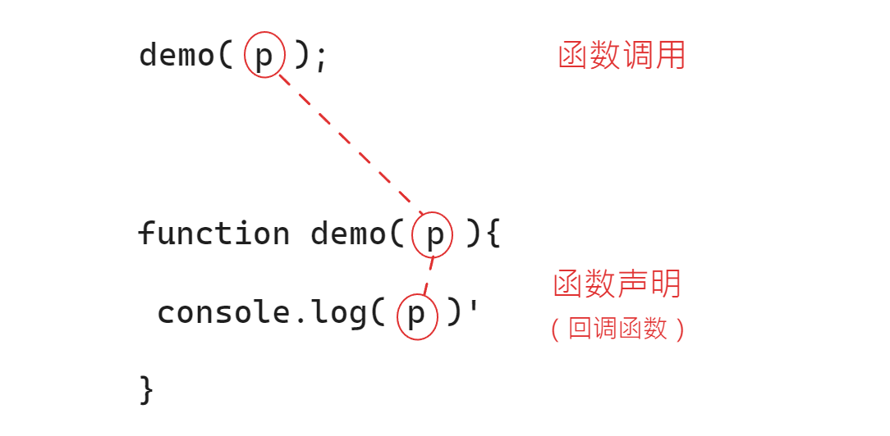

# Nodejs 学习笔记

> 名称：Node.js 完全指南（李立超）
>
> 地址：https://www.bilibili.com/video/BV1qN4y1A7jM/?vd_source=bc02b194f06ee6c081a8d33ad7b3824d
>
> 简介：讲师-李立超（超哥）
>
> 信息：全 34 集:24 时 53 分 44 秒 （二倍速：12 时 26 分 52 秒）
>
> 源码：链接：https://pan.baidu.com/s/1jE10ooFCzpV6ddSqHyYJow?pwd=9658
> 提取码：9658
>
> 学习目标：争取 1~2 周内搞定，提升效率，2023/5/20 ~
>
> 李立超博客（nodejs 配套笔记）：https://www.lilichao.com/index.php/2022/10/08/node-js%e7%ae%80%e4%bb%8b%e5%ae%89%e8%a3%85/

## Nodejs 简介和安装

**1，简介**

`Node,js`是一个构建在 V8 引擎之上的`JavaScript`运行环境。它使得 JS 可以运行在**刘览器以外**的
地方。相对于大部分的服务端语言来说，`Node,js`有很大的不同，它采用了**单线程**，且通过**异步**
的方式来**处理并发**的问题。

**2， 安装**

Step1：访问 [官网](https://nodejs.org/en) 下载 LTS 版本（18.16.0 LTS）

Step2：下载后本地 [安装](https://www.geeksforgeeks.org/installation-of-node-js-on-windows/)

Step3：测试安装是否成功，打开命令行，输入`node -v`，若输出版本信息`V.18.16.0`，则表示安装成功

**3，使用安装工具 nvm**

nvm 是 Node Version Manager 的简称，即为 node 版本管理工具。**建议使用 nvm 安装 nodejs**

Step1：进入 GitHub [release](https://github.com/coreybutler/nvm-windows/releases) 下载最新版本 [nvm-setup.exe](https://github.com/coreybutler/nvm-windows/releases/download/1.1.11/nvm-setup.exe)

Step2：下载后安装

nvm 常用命令

```bash
# 显示 已经安装的 node
nvm list
# -----------------安装-----------------
# 安装 指定版本的 node
nvm install <版本>
# 默认安装最新版
nvm install lastest
# 安装 lts (long time support)版本
nvm install lts

# 配置 nvm 镜像服务器 (以下是 阿里云 镜像地址)
nvm node_mirror https://npmmirror.com/mirrors/node/

# 指定 node 版本
nvm use <版本>
```

**4，使用 node**

方式 1：打开命令行，输入 `node`进入**交互式**命令行，此时的环境和使用浏览器打开**开发者模式**中的 console 一样，可输入 js 代码运行。

方式 2：创建`demo.js`文件，编写 js 代码，在此文件所在目录打开命令行，输入 `node ./demo.js` 即可执行 node。

方式 3：在 VScode 中使用命令行（bash）执行代码。

方式 4：在 VScode 中的 打开的`demo.js`文件中按 `F5`会弹出选项，选择 `node`执行代码。

**5，nodejs 和 javascript 的区别**

- `ECMAScript`：nodejs 和 javascript 都具有
- `DOM，BOM`：仅浏览器环境具有，js 有，而 nodejs 不具有

---

## 同步和异步

**1，进程和线程**

- 进程：程序的运行环境（理解为工厂的仓库）
- 线程：是实际运行程序的”东西“（理解为工人）

**2，同步和异步**

同步

- 同步代码会出现 **堵塞** 现象（自上而下，先后执行），会影响 **整体程序** 的执行
- 解决同步问题：其他语言（java，python）采取**多线程**解决 ； nodejs 是**单线程**，使用 **异步**方式 解决

异步

- 某段代码不会影响其他代码的执行
- **异步的问题**：异步代码无法使用 `return`设置返回值。因为 `return`是立即返回，但是异步带啊吗不需要立即返回。
- **特点**：（1）不会发生阻塞其他的代码的现象 ； （2）需要使用**回调函数**返回值
- 基于回调的异步实现（回调地狱） ：（1）代码可读性差 ； （2）可调试性差
- 解决回调地狱：思路——需要代替回调地狱返回值，引出` promise`

```javascript
// 下面三行代码是 同步执行，依次一行一行执行
console.log("111");
console.log("222");
console.log("333");
// 下面的代码，sum函数调用会影响下一行语句的执行
function sum(a, b, callback) {
	const begin = Date.now();
	setTimeout(() => {
		callback(a + b);
	}, 4000);
}
console.log("1111111");
// 使用回调函数
// 理解回调函数的作用：暂时储存某个封装的指令，等待合适时机执行
const result = sum(123, 456, (result) => {
	sum(result, 777, (result) => {
		sum(result, 888, (result) => {
			sum(result, 999, (result) => {
				sum(result, 000, (result) => {
					console.log(result);
				});
			});
		});
	});
});
console.log("2222222");
```

回调地狱的结构图：


---

## promise

- Promise 可以帮助我们解决异步中的回调函数的问题

- Promise 就是一个用来**存储数据的容器**，它拥有着一套特殊的存取数据的方式，这个方式使得它里边可以**存储异步调用的结果**

失败时的两种处理方式

- 通过 reject('data')
- 通过抛出 Error

1，通过 reject('data')

```javascript
const promise = new Promise((resolve, reject) => {
    setTimeout(() => {
        // 通过 函数形式 xxx('数据') 的好处可以添加异步调用的数据
        // resolve('成功了耶！');
        reject('哎！，失败了');
    }, 2000);
}
promise.then(
    // 对应 resolve()的结果 : 成功时执行
    (result) => { console.log("读取到了 promise 中的数据：", result); },
    // 对应 reject()的结果  : 失败时执行
    (result) => { console.log("读取到了 promise 中的数据：", result); }
)
```

输出：

```bash
读取到了 promise 中的数据：哎！，失败了
```

2，通过抛出 Error

```javascript
const promise = new Promise((resolve, reject) => {
	/*setTimeout(() => {
        // 通过 函数形式 xxx('数据') 的好处可以添加异步调用的数据
        // resolve('成功了耶！');
        // reject('哎！，失败了');
    }, 2000);*/
	throw new Error("失败了");
});
promise.then(
	// 对应 resolve()的结果 : 成功时执行
	(result) => {
		console.log("读取到了 promise 中的数据：", result);
	},
	// 对应 reject()的结果  : 失败时执行
	(result) => {
		console.log("读取到了 promise 中的数据：", result);
	}
);
```

输出：

```bash
读取到了 promise 中的数据： Error: 失败了
```

可以看到不同方式处理错误，输出结果有所不同。

---

```javascript
// ----------------- 1.创建 promise-----------------
// 格式：new Promise( function )
// resolve, reject 也是函数
const promise = new Promise((resolve, reject) => {
	// -----------------2.将数据存到 resolve中-----------------
	/* 
    关于 resolve 和 reject 使用
        - resolve ： 执行 正常 时储存数据
        - reject  ： 执行 异常 时储存数据
    */
	setTimeout(() => {
		// 通过 函数形式 xxx('数据') 的好处可以添加异步调用的数据
		// resolve('成功了耶！');
		// reject('哎！，失败了');
	}, 2000);
});
// -----------------3.从 promise 中读取数据：通过 then()-----------------
// then的格式：promise.then( fun1,fun2 )
promise.then(
	//fun1 对应 resolve()的结果 : 成功时执行
	(result) => {
		console.log("读取到了 promise 中的数据：", result);
	},
	//fun2 对应 reject()的结果  : 失败时执行
	(result) => {
		console.log("读取到了 promise 中的数据：", result);
	}
);

/*
promise 中维护了两个隐藏属性：
    - PromiseResult：用于储存数据
    - PromiseState：记录   Promise 状态（三种）
        - pending：进行中
        - fulfilled：完成：通过 resolve 储存数据时
        - rejected：拒绝/出错了：通过 reject 储存数据时
------------
1. 当 Promise 创建， PromiseState初始值为 pending
    - 当 储存数据通过 resolve, PromiseState 修改为 fulfilled, PromiseResult 变为 储存的数据
    - 当 储存数据通过 reject, PromiseState 修改为 rejected, PromiseResult 变为 储存的数据 或 异常对象
	
	
2. 当我们通过 then 读取数据时，相当于为 Promise 设置了回调函数，
    - 如果 PromiseState 变为fulfilled,则调用 then 的第一个回调函数来返回数据
    - 如果 PromiseState 变为rejected,则调用 then 的第二个回调函数来返回数据
*/
const promise2 = new Promise((resolve, reject) => {
	setTimeout(() => {
		resolve("成功了耶！");
	}, 2000);
});
promise2.then(
	(result) => {
		console.log(result);
	},
	(reason) => {
		console.log(reason);
	}
);

/**
catch() 用法和 then 类似，但是只需要一个回调函数作为参数
    - catch（）中的回调函数只会在Promise被拒绝时才调用
    - catch（）相当于then(null,reason=>{})
    - catch（）就是一个专门处理Promise异常的方法
 */
promise2.catch((reason) => {
	console.log("失败了");
});
/*
finally()
    - 无论是正常存储数据还是出现异常了，finally总会执行
    - 但是 finally 的回调函数中不会接收到数据
    - finally() 通常用来编写一些无论成功与否都要执行代码
 */
promise2.finally(() => {
	console.log("不管怎样，我都会执行~~~");
});
```

## promise 详解

1，将 回调函数地狱的异步代码 修改 为 使用 promise

```javascript
// -----------------1. 使用回调(地狱)的方式-----------------
function sum(a, b, cb) {
	// setTimeout 中是异步代码
	setTimeout(() => {
		cb(a + b);
	}, 1000);
}
// -----------------2. 使用 promise 的方式-----------------
function sum(a, b) {
	return new Promise((resolve, reject) => {
		setTimeout(() => {
			resolve(a + b);
		}, 1000);
	});
}
```

2，then ，catch 的使用

```javascript
/*
promise中的 then，catch这三个方法都会返回一个新的Promise
- then 中的 return 返回的内容作为新的 promise.then 回调中的数据（then 中 return的数据是下一次 then 中的参数）
 */
// const promise = sum(1, 2);

const promise = new Promise((resolve, reject) => {
	reject("我是返回值");
});
/**
 * then 和 catch
 * - then  用来处理 resolve 的操作，接受 成功情况下的返回值。resolve 遇到 catch从中会忽略
 * - catch 用来处理 reject  的操作，接受 失败情况下的返回值。reject  遇到 then 从中会忽略
 * - 如果 某个 catch 中 有错，则自身不处理，由后续处理。因此建议在最后使用 catch 以便可以处理所有错误。
 */
promise
	.then((r) => "嘿嘿")
	.catch((r) => {
		throw new Error("报个错玩");
		console.log("嘿嘿");
	})
	.then((r) => console.log("嘿嘿嘿"))
	.catch((r) => console.log(""));
// 说明：then 中的 return 返回的内容作为新的 promise.then 回调中的数据
promise
	.then((result) => {
		console.log(`result1: ${result}`);
		return result + 3;
	})
	.then((result) => {
		console.log(`result2: ${result}`);
		return result + 4;
	})
	.then((result) => {
		console.log(`result3: ${result}`);
		return result + 5;
	});
```

3，Promise 静态方法

```javascript
/**
 * 静态方法：
 *  - Promise.resolve() 创建立即 完成 的 promise
 *  - Promise.reject()  创建立即 拒绝 的 promise
 *  - Promise.all([...]) 同时返回多个 promise 的执行结果。”同生共死“，全部成功才成功，一个失败都失败（ a & b 为 真  ）
 *  - Promise.allSettled([...])  同时返回多个 promise 的执行结果。无论成功或失败
 *      {status: 'fulfilled', value: 579}
 *      {status: 'reject', reason: 579}
 *  - Promise.race([...]) 返回执行结果最快的 promise （不考虑成功失败）
 *  - Promise.any([...]) 返回执行结果最快的成功（resolve） 的promise 。都失败才失败 （ a | b  为 假 ）
 *
 */
Promise.resolve(10);
// 等价
new Promise((resolve, reject) => {
	resolve(10);
});
```

```javascript
function sum(a, b) {
	return new Promise((resolve, reject) => {
		setTimeout(() => {
			resolve(a + b);
		}, 1000);
	});
}
// -----------------1. Promise.all-----------------
Promise.all([sum(1, 3), sum(10, 20), sum(55, 66)]).then((r) => {
	console.log("r: ", r); // r:  (3) [4, 30, 121]
});
// -----------------2. Promise.allSettled-----------------
Promise.allSettled([
	sum(1, 3),
	sum(10, 20),
	Promise.reject("哈哈，出错了！"),
	sum(55, 66),
]).then((r) => {
	console.log("r: ", r); // r:  (3) [4, 30, 121]
});
// -----------------3. Promise.race-----------------
Promise.race([
	Promise.reject("哈哈，出错了！"),
	sum(1, 3),
	sum(10, 20),
	sum(55, 66),
]).then((r) => {
	console.log("r: ", r); // r:  (3) [4, 30, 121]
});
// -----------------4. Promise.race-----------------
Promise.any([
	Promise.reject("哈哈，出错1了！"),
	Promise.reject("哈哈，出错1了！"),
	Promise.reject("哈哈，出错1了！"),
]).then((r) => {
	console.log("r: ", r); // r:  (3) [4, 30, 121]
});
```

- all：all (resolve) ,then resolve
- any：any (resolve), then resolve

- 'all', 'or' stands for the condition leading result to be successful

## 宏任务和微任务

1，宏任务和微任务

```javascript
/**
 * JS 是单线程，运行基于事件循环机制（event loop）
 *  - 调用栈 ： 正在实行的（任务）代码 在栈中
 *  - 消息队列：等待执行的（任务）代码 在队列中
 * 执行任务顺序优先级：全局 > 微队列 > 宏队列
 * 任务队列分类
 *  - 宏任务
 *  - 微任务
 * 可使用 queueMicrotask() 添加任务到 微队列中
 *
 */
queueMicrotask(() => {
	console.log(3);
});
Promise.resolve(1).then(() => {
	console.log(1);
});
console.log(2);
/* setTimeout(() => {
    console.log(1);
}, 0);
Promise.resolve(1).then(() => {
    console.log(2);
})
console.log(3); */
```

2，初步手写 promise

```javascript
/**
 * 定义类的思路
 * 1.分析功能需求
 * 2.分步实现
 */

class MyPromise {
	#result; // 创建私有属性 用于储存 传入的数据作为 Promise的结果
	// 为了让 promise的状态只变动一次，设置变量储存状态
	#state = 0; // 0 表示未被修改，1表示被修改过
	constructor(executor) {
		// 接收执行器作为参数
		// // 解决this为undefined方案2：使用 bind() 改变函数 内部 this 指向
		executor(this.#resolve.bind(this), this.#reject.bind(this)); // 调用回调函数
	}
	// 实例方法
	// 通过 '#' 符号 将 resolve 和 reject 变成私有方法
	//  ⚠️ class 中 代码环境在 严格模式下 ，而 普通函数在严格模式下 this 为 undefined 。需要使用箭头函数
	#resolve(value) {
		if (this.#state) return; // 如果 state 为 true，则表示 state为1，被修改过，不能再修改
		// 当修改操作，则将 #state 变为 1 ，表示已经被修改
		this.#result = value; // this 为 undefine
		this.#state = 1;
	}
	/*  #resolve = () => {
         // 解决this为undefined方案1：此时使用箭头函数,this 为外部的this，即 类的实例 
         this.#resolve = value
         console.log("value: ", value);
     } */
	// 实例方法
	#reject(reason) {}
	// 添加一个用来读取数据的 then 方法
	then(onFulfilled, onRejected) {
		// 当获取了数据，才返回数据
		if (this.#state) {
			onFulfilled(this.#result);
		}
	}
}
const mp = new MyPromise((resolve, reject) => {
	resolve("foo");
	resolve("bar");
});
// console.log(mp); // MyPromise {#resolve: ƒ, #reject: ƒ, #result: 'foo'}
mp.then((result) => {
	console.log(result); // foo
});
```

理解 promise 的原理一定要深刻认识 函数调用 和 函数关系，特别是函数作为回调函数使用：



## 手写 promise 上

**情况 1：对于同步储存数据**

是 先 resolve 后 then ,因此数据和回调函数调用都发生在后者 then 中，然后取出

**情况 2：对于异步储存的数据**

是 先 then 后 resolve ，如果直接 then 中取出数据，则没有数据（resolve 没储存数据），因此数据是 `undefined`。因此取出数据操作只能在 `resolve` 完成。但 resolve 无法直接调用 then 中的调回取出数据，需要想办法。

解决：目前 then **只能读取已存**入 Promise 的数据，**不能读取异步储存的数据**

思路：等到 resolve 中异步储存的数据被获取到后，将数据通过 then 的回调函数取出。而直接在 resolve 中“看不见” then 中的回调，可以将回调储存在一个变量作为一个属性，这样整个类中可以使用。而被取出的数据只能在 resolve 中得到，**这样原本由 then 中调用回调函数，变为了 resolve 中调用回调函数，传入数据，取出数据**

```javascript
const PROMISE_STATE = {
	PENDING: 0,
	FULFILLED: 1,
	REJECTED: 2,
};
class MyPromise {
	#result;
	#state = PROMISE_STATE.PENDING;
	#callback; // 变量储存 then 中的回调函数 👈
	constructor(executor) {
		executor(this.#resolve.bind(this), this.#reject.bind(this)); // 调用回调函数
	}
	#resolve(value) {
		if (this.#state === PROMISE_STATE.FULFILLED) return;
		this.#result = value; // this 为 undefine
		this.#state = PROMISE_STATE.FULFILLED;
		queueMicrotask(() => {
			this.#callback && this.#callback(this.#result);
		});
	}
	#reject(reason) {}
	then(onFulfilled, onRejected) {
		if (this.#state == PROMISE_STATE.PENDING) {
			// 当 执行了 then 后，将回调函数储存到 callback变量中，让 resolve 可以使用 👈
			this.#callback = onFulfilled;
		} else if (this.#state === PROMISE_STATE.FULFILLED) {
			// then的回调函数，应该放入到微任务队列中执行，而不是直接调用
			queueMicrotask(() => {
				onFulfilled(this.#result);
			});
		}
	}
}
const mp = new MyPromise((resolve, reject) => {
	// setTimeout(() => {
	//     resolve('foo')
	// }, 1000);
	resolve("foo");
});
mp.then((result) => {
	console.log("result: ", result); // foo
});
```

两种情况的示意图：


